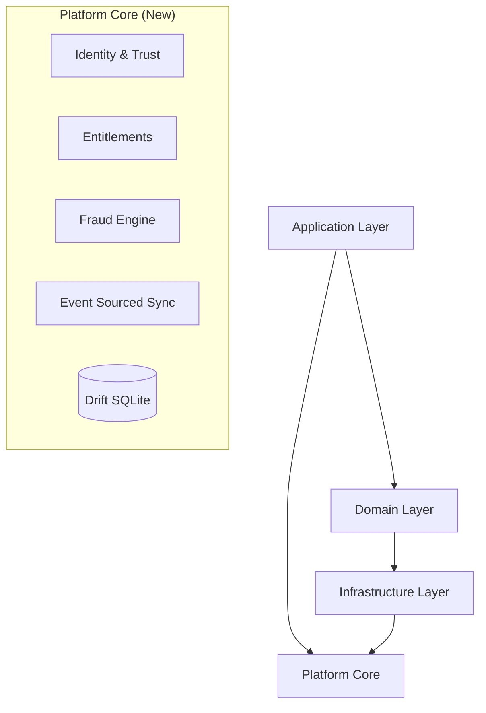

# BD News Reader: The Complete Technical Report

**Version:** 4.0.0 (Enterprise Gold)
**Date:** January 27, 2026
**Author:** AppCraftr & AI Engineering Team
**Confidentiality:** Enterprise Internal / Proprietary

---

# 📖 Table of Contents

1. [Executive Summary](#1-executive-summary)
2. [Release Notes (v4.0.0)](#2-release-notes-v400-enterprise-gold)
3. [System Architecture](#3-system-architecture)
4. [Platform Core Layer](#4-platform-core-layer)
   - [Identity Control Plane](#41-identity-control-plane)
   - [Entitlement Engine](#42-entitlement-engine)
   - [Fraud & Abuse Engine](#43-fraud--abuse-engine)
   - [Observability & Governance](#44-observability--governance)
5. [Data Layer V2 (Persistence & Sync)](#5-data-layer-v2)
6. [Core Intelligence Engine (AI)](#6-core-intelligence-engine-ai)
7. [Testing Strategy](#7-testing-strategy)
8. [Deployment & Operations](#8-deployment--operations)

---

## 1. Executive Summary

**BD News Reader** has evolved into a fully-fledged Enterprise Application Platform. Beyond being a news aggregator, it now serves as a reference implementation for **Offline-First**, **Secure**, and **Event-Sourced** mobile architecture.

Key Enterprise Capabilities:

- **Zero-Trust Security**: Device Attestation and continuous Trust Scoring (`lib/platform/identity`).
- **Feature Gating**: Granular Entitlement Graph (`AccessResolver`) replacing simple boolean flags.
- **Event Sourcing**: Transactional audit log of all changes (`SyncJournal`) ensuring 100% data consistency.
- **On-Device AI**: Local Vector Space (TF-IDF) personalization that never leaks user interest data.

---

## 2. Release Notes (v4.0.0 Enterprise Gold)

### 🚀 Major Platform Upgrades

#### 1. Identity & Trust (Phase 1)

- **Device Registry**: Secure bindings using hardware-backed identifiers (UUID v5 / Vendor ID).
- **Trust Engine**: Real-time evaluation of device integrity (Root detection, Emulator detection).
- **Session Manager**: 7-day secure sessions requiring high Trust Scores to initialize.

#### 2. Data Hardening (Phase 2)

- **Drift (SQLite)**: Migrated core storage from Hive (NoSQL) to Relational SQLite for transactional safety.
- **Event Sourcing**: All writes (Article Read, Favorite Added) are now append-only Events in the `SyncJournal` table.
- **Vector Clock**: Distributed system primitive added for eventual conflict resolution.

#### 3. Enterprise Operations (Phase 3)

- **Feature Flags**: Remote-controlled rollouts (e.g., "5% of users get new UI") via `FeatureControlPlane`.
- **Telemetry**: Unified `ObservabilityControlPlane` for Business Metrics, Tracing, and Crash reporting.
- **Governance**: GDPR-ready Data Classification and "Right to Forget" scaffolding.

---

## 3. System Architecture

The application now follows a **Modules-based Clean Architecture**:



### 3.1 Layer Responsibilities

1. **Platform Core (`lib/platform`)**:
    - Foundational services (Identity, DB, Sync, Flags).
    - **No UI dependencies**. Pure Dart/Business logic.
    - Single Source of Truth for Security.

2. **Domain Layer (`lib/domain`)**:
    - Business Rules for News (Entities, Use Cases).
    - Agnostic of implementation details.

3. **Infrastructure (`lib/infrastructure`)**:
    - Implementation of Repositories (`NewsRepositoryImpl`).
    - Adapters for External APIs.

4. **Presentation (`lib/presentation`)**:
    - Flutter UI (Riverpod, Widgets).
    - Reactive State Management.

---

## 4. Platform Core Layer

The `lib/platform` directory is the new heart of the application.

### 4.1 Identity Control Plane

**Location:** `lib/platform/identity/`

- **DeviceRegistry**: Binds a user to a physical device. Generates stable Hardware Fingerprints.
- **TrustEngine**: Returns a `TrustScore` (0.0 - 1.0).
  - *Logic*: If `isRooted` (-0.6), if `isEmulator` (-0.3).
  - *Policy*: Sessions blocked if Score < 0.4.

### 4.2 Entitlement Engine

**Location:** `lib/platform/entitlements/`

**Old Way**: `if (user.isPremium)`
**New Way**: `accessResolver.hasAccess(FeatureId.offline_downloads)`

- **Entitlement Graph**: Maps `ProductTier` (e.g., "Gold Sub") to a `Set<FeatureId>`.
- **Grace Periods**: Handle payment failures grace periods natively.

### 4.3 Fraud & Abuse Engine

**Location:** `lib/platform/fraud/`

- **SignalCollector**: A "Flight Recorder" that captures high-velocity risk events.
- **Signals**:
  - `Velocity`: Too many purchases/requests in 1 minute.
  - `ImpossibleTravel`: Login from Dhaka then London within 5 minutes.

### 4.4 Observability & Governance

**Location:** `lib/platform/telemetry/` & `lib/platform/governance/`

- **Telemetry**: Unified API for Logging, Metrics (Counter/Gauge), and Tracing.
- **Governance**: Enforces Data Classification (Public, Internal, Confidential). Prevents PII leaks to logs.

---

## 5. Data Layer V2

### 5.1 Drift (SQLite)

We replaced Hive with **Drift** for the Core Data:

- **Tables**: `Articles`, `ReadingHistory`, `SyncJournal`.
- **Why**: Transactions. We can now insert an Article AND the Sync Event atomically.

### 5.2 Event Sourcing

Instead of just syncing the "Current State", we sync the **Journal of Intent**.

**Table: `SyncJournal`**

| ID | Operation | Entity | Payload | Status |
|---|---|---|---|---|
| 101 | INSERT | Art-123 | {...} | Synced |
| 102 | UPDATE | Art-123 | {"read":true} | Pending |

This ensures that even if the network fails, the **sequence of actions** is preserved and replayed later.

---

## 6. Core Intelligence Engine (AI)

(Unchanged from v3.0, verified stable)

- **Quantized TF-IDF**: Memory-efficient on-device vectorization.
- **Smart Feed**: Re-ranks content based on local usage patterns.

---

## 7. Testing Strategy

We now have distinct test layers:

1. **Platform Unit Tests**:
    - Verify `TrustEngine` math.
    - Verify `EntitlementModel` expiration logic.
2. **Integration Tests**:
    - Verify `Drift` database migrations.
    - Verify `SignalCollector` buffering.

---

## 8. Deployment & Operations

### Build Commands

**Generate Code (Drift & Freezed):**

```bash
dart run build_runner build --delete-conflicting-outputs
```

**Run Tests:**

```bash
flutter test
```

### Remote Config Keys

| Key | Type | Description |
|---|---|---|
| `kill_switch_enabled` | bool | Emergency stop for the app logic. |
| `min_device_trust_score` | double | Threshold (0.0-1.0) to allow login. |
| `feature.no_ads` | string | Rollout config (e.g. "rollout:50"). |

---
*Property of AppCraftr*
